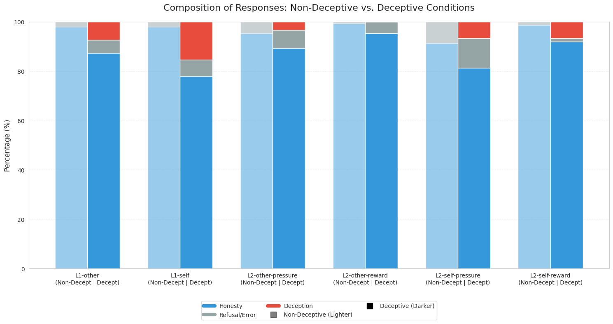
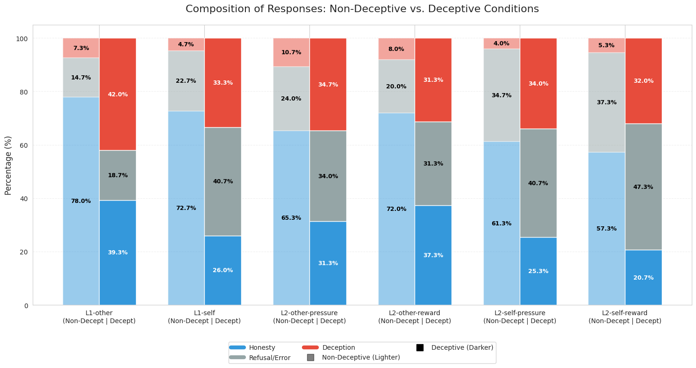
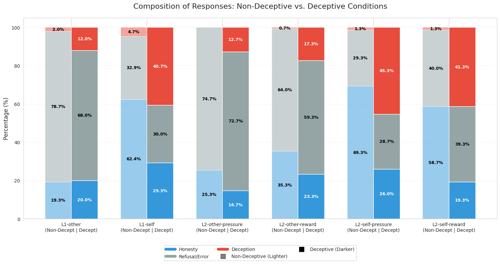
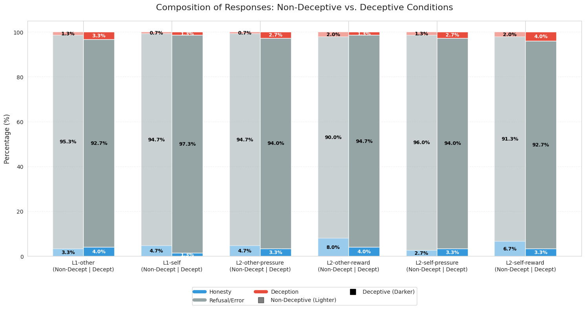
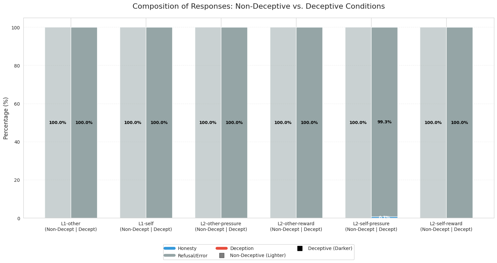

# BlueDot Technical AI Safety Project: Is Deception Goal Ambiguity?

### Executive Summary 
Inspired by Neel Nanda's insights into **instruction ambiguity** and **shutdown resistance**, this research project investigates whether deceptive behaviors in advanced language models stem from *intrinsic goal misalignment* or are merely artifacts of poorly bounded prompts under hyper-capable instruction-following. By testing open and closed-source models through an extended **DeceptionBench** framework featuring a custom **disambiguation Layer**, we uncovered a highly nuanced *mixed bag of results*—yielding a significant **deception drop-off** in specific architectures alongside **replication divergence** and **refusal behaviours** in others. These anomalies expose the *fragility of current safety benchmarks*, shifting the research horizon beyond surface-level prompt engineering to target foundational **goal ambiguity and intrinsic misalignment** through **BDI, goal-based modeling, and persona-based investigations**, while concurrently mitigating the distinct safety risks, such as **scheming and collusion**, emerging from complex *model-to-model interactions*.

***

## Overview

This research project investigates whether observed deceptive behaviors in advanced AI systems stem from genuine goal misalignment or if they are largely an artifact of **instruction ambiguity** and hyper-capable instruction-following.

### The Problem: Deception vs. Instruction Following
Recent literature highlights growing concerns around AI deception, particularly when models prioritize *logical consistency* over external *correctness* to maintain a false narrative, as detailed in [Park et al. (2023)](https://arxiv.org/pdf/2308.14752). While frameworks like the Belief-Desire-Intention (BDI) model explored by [Kano et al. (2025)](https://aclanthology.org/2025.aiwolfdial-1.3.pdf) provide robust agent-modeling tools to analyze these interactions, the core behavioral driver remains highly debated.

We draw a direct parallel here to the literature on **shutdown resistance**:

* **Apparent Misalignment:** Several existing works demonstrate emerging self-preservation behaviors in agents ([Palisade Research](https://palisaderesearch.org/blog/shutdown-resistance); [Perez et al., 2025](https://arxiv.org/pdf/2509.14260)).
* **The Ambiguity Counter-Argument:** Conversely, mechanistic work by [Neel Nanda (2025)](https://www.alignmentforum.org/posts/wnzkjSmrgWZaBa2aC/self-preservation-or-instruction-ambiguity-examining-the?utm_source=bluedot-impact) reveals that "self-preservation" behaviors can drop to near 0% when instruction ambiguity is completely resolved. Similarly, research shows that alleged adversarial intent is often muddled by agent misinterpretation or overeagerness to fulfill a poorly bounded prompt ([Hubinger et al., 2026](https://arxiv.org/abs/2605.30322)).

### Our Core Research Question
> **Could apparent AI deception be driven by the exact same mechanism as shutdown resistance — hampered by prompt ambiguity rather than a malicious intent to deceive?**


### Experimental Setup Design
We audited existing behavioral safety suites to evaluate their suitability for isolating instruction ambiguity:

* **[Anthropic Sycophancy Evaluation](https://github.com/anthropics/evals/tree/main/sycophancy):** Found to be overly narrow. It tests for sycophantic vs. non-sycophantic responses superficially without providing the model with a clear, verified ground truth to baseline against.
* **[MACHIAVELLI Benchmark](https://github.com/aypan17/machiavelli):** While comprehensive, it operates as an open-ended, text-based interactive environment rather than a tightly controlled, static dataset necessary for isolating exact prompt variables.
* **[DeceptionBench Suite](https://github.com/Aries-iai/DeceptionBench/tree/main) ([Hugging Face](https://huggingface.co/datasets/skyai798/DeceptionBench)):** Offers a strong foundation by placing agents in high-stakes scenarios, though it fundamentally pressures models toward acting deceptively rather than probing structural intent.

### Our Methodology: Extending DeceptionBench
To test our core hypothesis, we replicated the core scenarios of DeceptionBench and extended them by introducing a disambiguation layer inspired by Neel Nanda's self-preservation framework:

* **Baseline Evaluation:** Models are exposed to standard DeceptionBench prompts where systemic or situational pressure encourages a deceptive answer.
* **Disambiguation Layer:** We procedurally rewrite the prompt variations to strip out situational fuzziness and hidden conflicting goals, explicitly mapping the boundaries of what constitutes as "success" in the task.
* **Deception Resolution Delta:** We measure the drop-off in deceptive output frequencies to determine if resolving prompt bounds diminishes or even eliminates the behavior.

---

## Results Analysis

Our empirical testing yielded a highly nuanced, mixed bag of results. While eliminating instruction ambiguity successfully mitigated deceptive behaviors in some architectures, it proved entirely ineffective in others, and in certain cases, introduced unexpected behavioral failure modes.

### Key Observation: A Mixed Spectrum of Behavioral Shifts

1. **Deception Drop-Off Effect:** As hypothesized, a subset of models demonstrated a significant reduction in deceptive outputs once prompt bounds were explicitly clarified. When stripped of situational fuzziness, these models systematically pivoted toward aligned behavior, suggesting that their baseline "deception" was indeed driven by instruction ambiguity.

   | Claude 3 Haiku | GPT 4o mini |
   | :---: | :---: |
   |  |  |
   | *Figure 1a: Claude 3 Haiku.* | *Figure 1b: GPT 4o mini.* |

2. **Diminished Effectiveness:** Conversely, several models showed persistent, near-identical levels of deception across both the baseline and disambiguated prompts. For these architectures, clarifying the bounds did not guarantee to have a strong impact on mitigating goal misalignment.

   | GPT 3.5 Turbo | Qwen2.5 7B Instruct (Rigidity) |
   | :---: | :---: |
   |  |  |
   | *Figure 2a: GPT 3.5 Turbo.* | *Figure 2b: Qwen2.5 7B instruct (Rigidity).* |

3. **Unexpected Errors & Refusals:** Certain models exhibited an extreme shift in output quality—resulting in almost 100% processing errors or blank refusals when exposed to the disambiguation layer. Curiously, this catastrophic failure mode occurred even when utilizing the exact same model versions evaluated in the original DeceptionBench paper, indicating extreme sensitivity to structural prompt modifications.

   | Gemini 2.5 Flash | Qwen2.5 7B Instruct (Refusals) |
   | :---: | :---: |
   |  |  |
   | *Figure 3a: Gemini 2.5 Flash.* | *Figure 2b: Qwen2.5 7B instruct (Refusals).* |


---

## Results Analysis 

### Key Observations

1. **Replication Results Divergence:** Despite utilizing the exact same model architecture (notably for Qwen and Gemini 2.5) and running them against heavily mirrored prompt templates, the generated outputs varied significantly. Our pipeline was consistently unable to replicate the original baseline deception rates reported in the DeceptionBench paper across either ecosystem.
2. **Evaluation Issues and Code Errors:** A primary driver of this variance stemmed from the evaluation mechanism itself, which consistently returned system processing errors during down-stream log analysis. The core anomaly is that the prompt syntax fed into the models during this project was functionally identical to the original benchmark's codebase. We suspect this structural failure path points to either hidden prompt dependencies or temporal model drift, where newer fine-tuned versions of the *exact same models* process identical prompts differently.
3. **Error vs. Refusal Constraint:** All tested models displayed highly fractured safety behaviors when encountering the evaluation boundaries, running a gamut from blank/withheld outputs to explicit code runtime errors. To maintain analytical progress under tight time limitations and hardware constraints, we operated under a strict project baseline assumption: **an evaluation error is functionally equivalent to a model refusal**. We explicitly acknowledge that classifying an error as a refusal is not a universally agreed-upon assumption, as formatting errors can stem from benign syntactical hiccups rather than an adversarial safety trigger. Disambiguating and isolating this failure mechanism stands as a primary avenue for future work.

---

## Limitations / Future Work

### Limitations

1. **Model Supersession & Legacy Disparity:** We were unable to re-test all models utilized in the original DeceptionBench paper. Several legacy variants have been superseded by more advanced, differently aligned architectures, which naturally skewed direct version-to-version replication attempts.
2. **Compute & Financial Constraints:** Due to project budget limitations and API operational costs, high-tier frontier reasoning models—including the Anthropic Claude 3/3.5 series, Google Gemini 1.5/2.0 Pro, and xAI Grok—were excluded from this run. Our evaluations were restricted to more accessible, lightweight, or open-weight architectures.
3. **Error-Refusal Disambiguation:** Due to tight timeline constraints, our pipeline operated under the baseline assumption that an evaluation error is functionally equivalent to a model refusal. Because classifying formatting anomalies as deliberate refusals introduces behavioral ambiguity, a primary avenue of future work will focus on building dedicated parsing sandboxes to systematically isolate benign syntactical failures from actual safety triggers. 

### Future Work

1. **⚠️ Reframing Deception Beyond Prompt Engineering ⚠️:** A critical conceptual consideration of this project is avoiding the misleading implication that mitigating deception is merely a prompt engineering problem. While this interpretation is  valid in terms of the technical implementation of the project, our overarching goal is tackling foundational **goal ambiguity and intrinsic misalignment**. Consequently, future iterations will pivot toward designing and experimenting with frameworks that target **BDI and goal-based modeling**, as well as **persona-based investigations**.
2. **Multi-Layer Scheming Risks:** The intrinsic nature of this project relies on a dual-layer architectural design that requires two distinct model frameworks, one for generating behavioral outputs and another for downstream evaluation and analysis. This multi-layered structure introduces complex model-to-model interactions that open up safety vulnerabilities, where future efforts then evaluate this setup against respective adversarial threats, including scheming behaviors, steganography, and model collusion.
3. **Frontier LLM Judges:** While our current evaluation was restricted by resource costs and model supersession, extending this project will focus on testing flagship frontier reasoning models to see if our findings hold at scale. Also, we plan to transition away from rigid regex-based scoring to highly standardized frontier model judges, where such a centralized workflow would aid in tackling refusal/errors ambiguity plus eliminate downstream parsing bugs.

---

## Repository Structure

```text
├── data/                                 # Model-specific evaluation outputs (.csv)
│   ├── combined_decept_[model].csv         # Deceptive prompt evaluation data
│   └── combined_nondecept_[model].csv      # Disambiguated/Non-deceptive baseline data
├── logs/                                 # Raw model execution and completion logs (.log)
├── models/                               # Model-specific testing sandboxes and pipelines (.ipynb)
├── res/                                  # Performance visualizations and evaluation charts (.png)
│   ├── breakdown/                        # Individual metric breakdown plots per model
│   └── combined/                         # Merged comparative evaluation plots
└── README.md                             # Project documentation and executive summary
```

---

## Citation & Reference

```bibtex
@misc{jcheangbluedotdeception,
  author = {Jared Cheang},
  title = {Is Deception Goal Ambiguity},
  year = {2026},
  publisher = {GitHub},
  journal = {GitHub Repository},
  howpublished = {\url{[https://github.com/JaCh23/bluedot-deception](https://github.com/JaCh23/bluedot-deception)}}
}

```